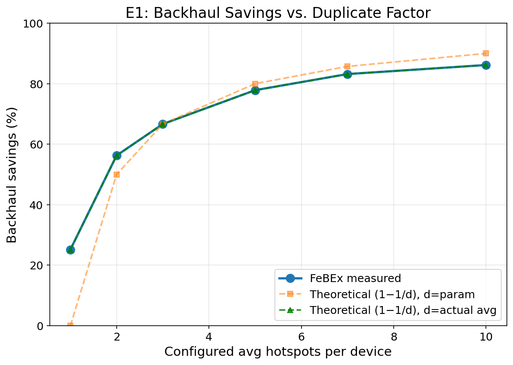
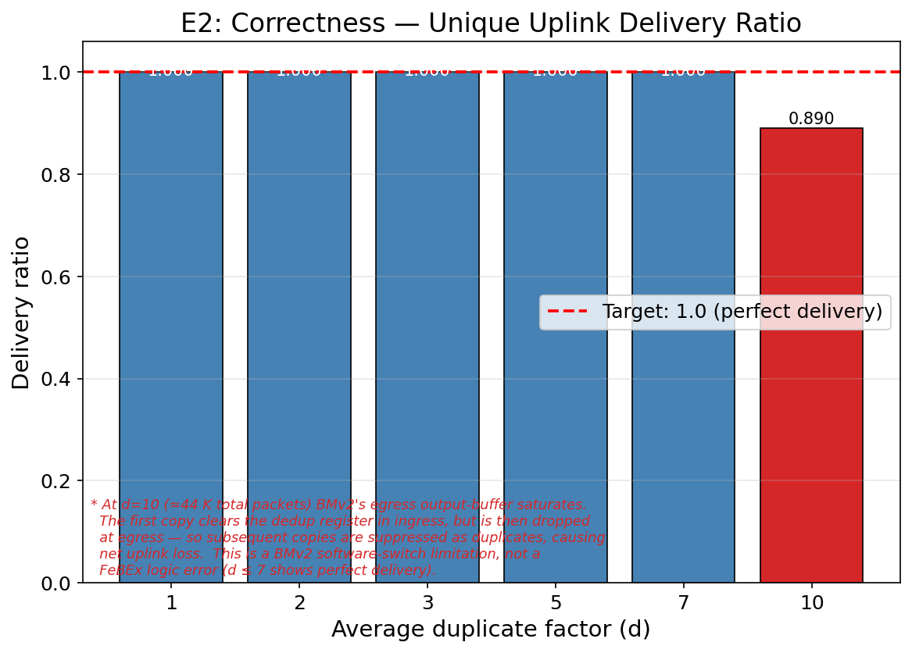
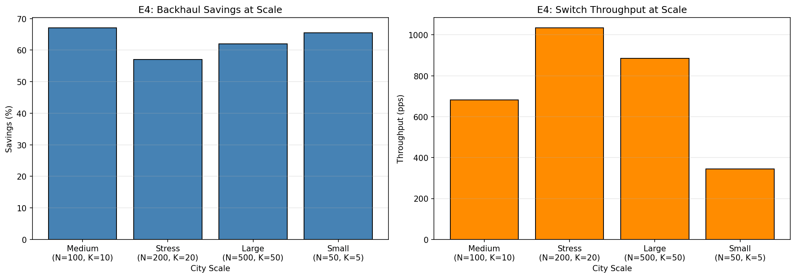
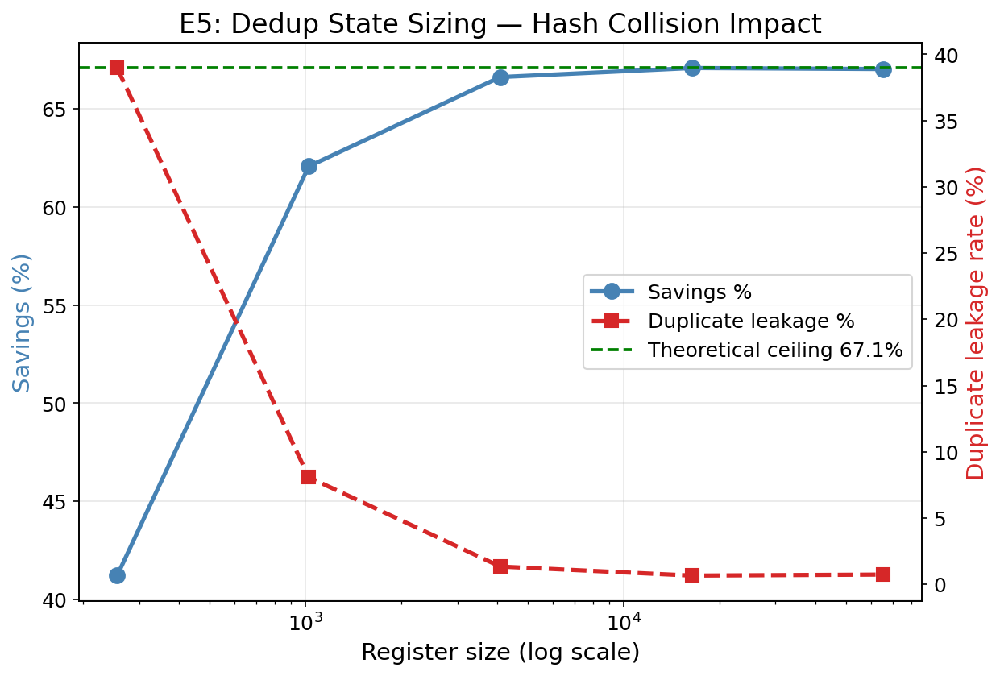
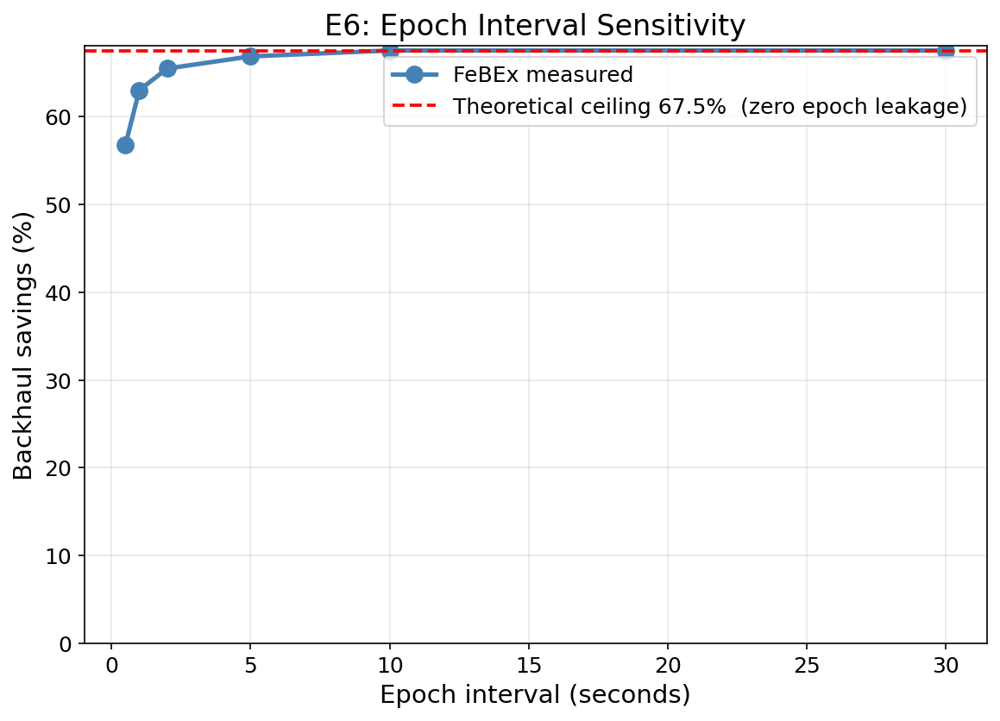
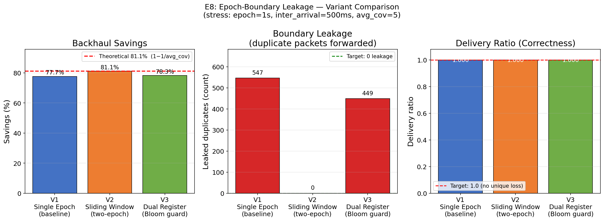

# FeBEx Evaluation Results

Slidev deck for evaluation-only section (E1–E8)

---
layout: default
---

# Live Visualization Demo

Main takeaway: We will run the network visualizer during presentation.

  [Intentionally left blank for live visualizer run]

Command during talk: <code>python tasks/febex/visualize_network.py</code>

---
layout: default
---

# E1: Backhaul Savings vs Duplicate Factor

  
Main takeaway: Savings scales strongly with overlap in hotspot coverage.

  <ul>
    <li>Savings rises from <b>25.2%</b> at avg_dup=1 to <b>86.2%</b> at avg_dup=10.</li>
    <li>Trend follows expected behavior as duplicate factor increases.</li>
    <li>FeBEx retains one useful uplink copy in backhaul.</li>
  </ul>
  
Params: N=100, K=10, M=2 | uplinks/device=50 | avg_dup sweep 1→10

  
  
25.2%

  
86.2%

---
layout: default
---

# E2: Correctness — Unique Uplink Delivery

  
Main takeaway: Unique uplink delivery is perfect in practical overlap ranges.

  <ul>
    <li>Delivery ratio is <b>1.000</b> for avg_dup = 1, 2, 3, 5, 7.</li>
    <li>At stress point avg_dup=10, observed ratio is <b>0.890</b>.</li>
    <li>Short reason: BMv2 egress-buffer overflow can drop first-arriving copies.</li>
  </ul>
  
Params: N=100, K=10, M=2 | duplicate-factor sweep as in E1

  
  
1.000

  
0.890

---
layout: default
---

# E3 & E7: Verified from Logs (No Plot)

Main takeaway: Both isolation and receipt-accounting checks pass from logs.

- **E3 Multi-tenant isolation:** 0 cross-tenant violations over 5,071 packets (**PASS**).
- **E7 Payment receipt accuracy:** 1,021 cloud receipts = 1,021 forwarded packets; valid gw_id 1,021/1,021; match rate = 1.0.

Verified from logs: results/**/lns*.tsv and cloud_receipts.tsv | Params: E3(N=100,K=10,M=4), E7(N=50,K=5,M=2), dedup ON

---
layout: default
---

# E4: City-Scale Scalability

  
Main takeaway: Dedup savings remain stable as city size increases.

  <ul>
    <li>Savings stays around <b>62–67%</b> across tested scales.</li>
    <li>Medium case can exceed theory slightly due to Poisson coverage randomness.</li>
    <li>Throughput rises to <b>1034 pps</b>, then soft-saturates on BMv2 software limits.</li>
  </ul>
  
Params: (N,K)=(50,5),(100,10),(200,20),(500,50) | M=4 | avg_cov≈3

  
  
345 pps

  
1034 pps

  
62–67%

---
layout: default
---

# E5: Dedup State Sizing (Hash Collisions)

  
Main takeaway: Undersized dedup state significantly reduces suppression quality.

  <ul>
    <li>At 256 entries, leakage reaches <b>39.0%</b> and savings drops to <b>41.2%</b>.</li>
    <li>At 4,096+ entries, collision effect becomes small and savings stabilizes.</li>
    <li>State sizing directly controls practical dedup effectiveness.</li>
  </ul>
  
Params: N=100, K=10, M=2 | register sweep 256→65,536

  
  
39.0% leakage

  
~67% plateau

---
layout: default
---

# E6: Epoch Interval Sensitivity

  
Main takeaway: Longer epochs improve dedup effectiveness in this workload.

  <ul>
    <li>0.5s epoch gives <b>56.8%</b> savings.</li>
    <li>10–30s epochs reach top observed savings of <b>~67.5%</b>.</li>
    <li>Observed practical operating range: 5–10 seconds.</li>
  </ul>
  
Params: N=100, K=10, M=2 | epoch sweep 0.5,1,2,5,10,30 s

  
  
56.8%

  
67.5%

---
layout: default
---

# E8: Epoch-Boundary Leakage — Variant Comparison

  
Main takeaway: V2 sliding-window is strongest under boundary stress.

  <ul>
    <li>V2: <b>81.1%</b> savings, 0 leaked duplicates.</li>
    <li>V1/V3: 77.7% / 78.3% due to residual leakage.</li>
    <li>Best variant in this stress profile: <b>V2</b>.</li>
  </ul>
  
Stress params: N=100,K=10,M=2 | epoch=1s | inter-arrival=500ms | avg_cov=5.3

  
  
V1: 77.7%

  
V2: 81.1%

  
V3: 78.3%

---
layout: center
class: text-center
---

# End of Evaluation Deck

Ready to export to PPTX and merge with the main presentation.
